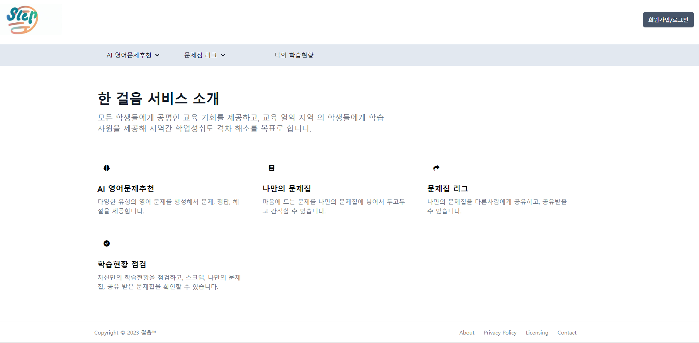

# 영어 문제 추천 서비스 - OneStep
## 1. 프로젝트 소개

**지역간 교육 불평등을 최소화하기 위한 서비스입니다!!!**

 

## 2. 팀원

<table>
  <tr>
    <td align="center"><a href="https://github.com/bbbbooo">
    <td align="center"><a href="https://github.com/myrhymetree">
    <td align="center"><a href="https://github.com/pyunghun">
    </td>
  </tr>
  <tr>
    <td align="center"><a href="https://github.com/bbbbooo"><b>이현석</b></td>
    <td align="center"><a href="https://github.com/myrhymetree"><b>박성준</b></td>
    <td align="center"><a href="https://github.com/pyunghun"><b>조평훈</b></td>
  </tr>

</table>

 

## 3. 기능
- ### 회원가입 / 로그인
  - 카카오 기반 oauth 인증
  - JWT 토큰 사용
  
  
  

 

- ### 문제 추천 & 문제 풀이
  - Flask(서빙 서버)에서는 자정을 기준으로 매일 각 유형별 문제를 200개씩 생성함
  - 문제는 서빙 서버의 데이터베이스에 기록됨
  - Spring(운영 서버)은 서빙 서버의 데이터베이스에서 생성된 순서대로 문제를 10개씩 추출
  - 사용자는 추출된 문제를 해결
  - 문제의 재사용성을 위하여, 풀이 기록 테이블을 만들어 A 사용자가 해결한 문제더라도 
  - B 사용자가 푼 기록이 없다면 B 사용자는 A 사용자가 본 문제를 풀 수 있음
  
   
  
    

   
   

- ### 스크랩
  - 문제를 풀고 스크랩 버튼을 누르면, 나의 학습 현황 > 나의 스크랩으로 저장됨
  - 선택 체크박스를 통하여 스크랩을 삭제할 수 있음

   
  
  

 
 

- ### 나만의 문제집
  - 스크랩 페이지의 선택 체크 박스를 통하여 문제들을 토대로 나만의 문제집으로 만들 수 있음
  - 문제집 내, 문제들의 유형을 라벨로 확인 가능
  - 나만의 문제집은 다른 사람과 공유 가능
  - 문제집을 PDF로 만들어 출력 가능

  

 

  - 옵션을 통해 원하는 라벨의 문제만 볼 수 있음
  - OR 연산

  

 
 

- ### 문제집 리그
  - 문제 공유 버튼을 통해, 다른 사용자와 내가 만든 문제집을 공유할 수 있음
  - 좋아요 실시간 렌더링, 추후 좋아요를 많이 받은 문제집 상단 노출 업데이트 예정
  - 문제집 리그에서 푼 문제집은 자동으로 나만의 문제집에 저장됨
  

  

-----------------------------------

#### 📝 Project Rules
* Issue가 생기면 Repository의 Issues에 기록하기
* main branch에 바로 push 금지! develop branch로 Pull requests 하기
* git convention을 지키기
* pr 전에 이슈 발행 필수, pr 할 때 이슈 번호 입력 필수!
* 이슈 1개 당 pr 1개
* 이슈 하나는 본인이 하루 내에 해결할 수 있는 양으로 선정하기
* pr에 모든 사람이 코드 리뷰 남기기 (LGTM 금지🙅)

#### 🏷️ Git Convention
| **Convention**  | **내용**                                                         |
|-----------------|----------------------------------------------------------------|
| **Feat**        | 새로운 기능 추가                                                      |
| **BugFix**         | 버그 수정                                                          |
| **Test**        | 테스트 코드, 리펙토링 테스트 코드 추가, Production Code(실제로 사용하는 코드) 변경 없음     |
| **Comment**     | 필요한 주석 추가 및 변경                                                 |
| **Rename**      | 파일 혹은 폴더명을 수정하거나 옮기는 작업만인 경우                                   |
| **Remove**      | 파일을 삭제하는 작업만 수행한 경우                                            |
| **Design**      | CSS 등 사용자 UI 디자인 변경                                            |
| **Refactor** | 프로덕션 코드 리팩토링                                                   |

---------------------------------------------------
